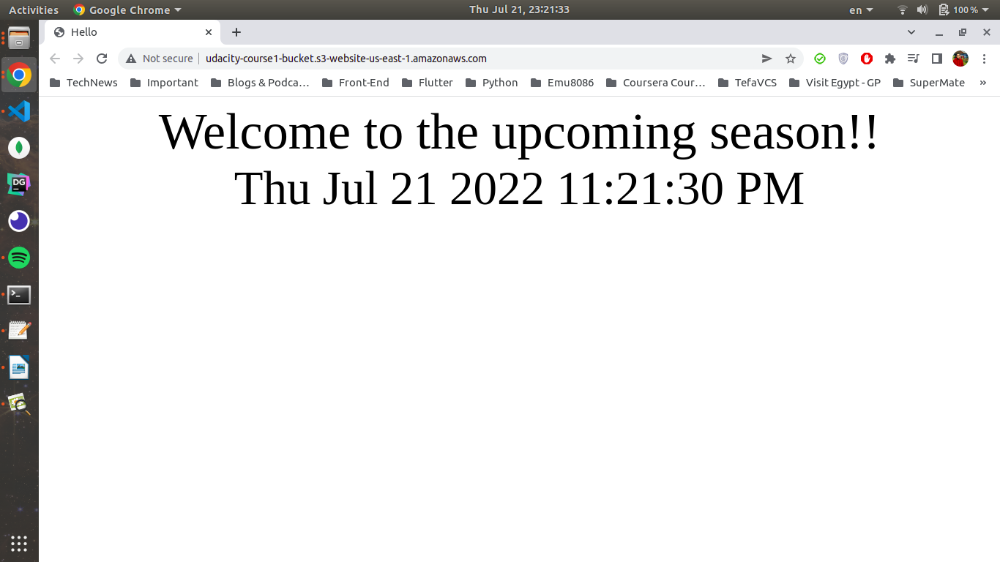

# Data durability and recovery

This project is part of the Udacity Cloud Architect Nanodegree.

The goal of this project is to :
- Build a Multi-AvailabilityZone, Multi-Region database and show how to use it in multiple geographically separate AWS regions.
- Build a website hosting solution that is versioned so that any data destruction and accidents can be quickly and easily undone.

Here is a visualisation of the Cloud Architecture for this project using [Lucid Chart](https://www.lucidchart.com):


The instructions for this project are available [here](https://github.com/udacity/nd063-c2-design-for-availability-resilience-reliability-replacement-project-starter-template).

## Project Setup
### Cloud formation
In this project, I used the AWS CloudFormation to create Virtual Private Clouds. CloudFormation is an AWS service that allows you to create "infrastructure as code". 

A configuration file written in a YAML file was provided to automate the creation of the VPCs with public and private subnets and Security Groups. The YAML file is available in this GitHub repo: https://github.com/udacity/nd063-c2-design-for-availability-resilience-reliability-replacement-project-starter-template/blob/master/cloudformation/vpc.yaml

### Part 1

### Data durability and recovery
In order to achieve the highest levels of durability and availability in AWS, I deployed a Cloud Formation in 2 AWS regions: An active region and a standby region with different CIDR address ranges for the VPCs.

**Primary VPC:**


**Secondary VPC:**


### Highly durable RDS Database

To secure the access of the database, I created a new RDS **private Subnet group** in the active and standby region. This means that traffic coming directly from the Internet will not be allowed. Only traffic coming from the VPC.

**Subnet groups in the active region:**


**Subnet groups in the secondary region:**


As shown below, public subnets allow traffic incoming from the internet (while private subnet only allows incoming traffic from the VPC)

**Route tables in subnet of the active region:**


**Route tables in subnet of the secondary region:**


I created a new MySQL with the following parameters:
- Multi-AZ database to ensure a smooth failover in case of a single AZ outage
- Have only the “UDARR-Database” **security group**. This security group was defined in the Cloud Formation to only allow traffic from the EC2 instance (not yet created). More specifically, this “UDARR-Database” security group allows traffic from "UDARR-Application" security group inside the VPC using this specific port: 3306 (mysql port).
- Have an initial database called “udacity.” 

**Configuration of the database in the active region:**


After the primary database has been set up, I created a read replica database in the standby region. This database has the same requirements as the database in the active region.

**Configuration of the database in the secondary region:**


### Estimate availability of this configuration

Description of Achievable Recovery Time Objective (RTO) and Recovery Point Objective (RPO) for this Multi-AZ, multi-region database in terms of:

1. Minimum RTO for a single AZ outage 
From AWS Multi-AZ documentation, we ca conclude that the time to complete switching to a different AZ is between 60 to 120 seconds.

	Documentation:  https://docs.aws.amazon.com/AmazonRDS/latest/UserGuide/Concepts.MultiAZ.html
    
2. Minimum RTO for a single region outage
If a complete region outage occurs, the following scenario may happen:
- 02:00 AM: a problem happened to the region (0 minutes).
- 02:03 AM: the alert is triggered after 3 minutes of discovering the problem (3 minutes).
- 02:20 AM: the support is alerted, got up from his bed, reached the computer, and logged into the system (20 minutes).
- 02:30 AM: Root cause is known by the support engineer (10 minutes).
- 02:35 AM: Started solving the problem by promoting the secondary DB to be the master DB and routing the traffic to it (5 minutes).
- 02:50 AM: the solution is completed and all is OK (15 minutes).

The total needed time is: 50 minutes

3. Minimum RPO for a single AZ outage
Since the primary database is a synchronous standby copy with the Multi-AZ setup, there would be no data loss.
       
4. Minimum RPO for a single region outage 
The RPO will depend on how frequently data is backed up if we configure an RDS database with automated backups turned on. The minimum RPO will be 4 hours if we set up backups every 4 hours.

### Demonstrate normal usage

In the active region:
I created an EC2 keypair and launched an Amazon Linux EC2 instance in the active region with the following configuration:
- VPC's public subnet
- Security group ("UDARR-Application") that allows incoming traffic (SSH) from the Internet.

I established a SSH connection to the instance by running this command:
```
ssh -i {absolute/path/to/PrimaryKeyPair.pem} {EC2 identifiers provided on the EC2 console while clicking on connect}
```
After being connected and having mysql installed, I connected to my database by running this command:
```
mysql -u admin -p -h {PRIMARY_DATABASE_ENDPOINT}
```

Log of connecting to the database, creating the table, writing to and reading from the table:

	    ubuntu@ip-10-4-15-158:~$ mysql -u admin -p -h ud-primary.cyehns0bq166.us-east-1.rds.amazonaws.com -P 3306
	Enter password: 
	Welcome to the MySQL monitor.  Commands end with ; or \g.
	Your MySQL connection id is 43
	Server version: 8.0.28 Source distribution

	Copyright (c) 2000, 2022, Oracle and/or its affiliates.

	Oracle is a registered trademark of Oracle Corporation and/or its
	affiliates. Other names may be trademarks of their respective
	owners.

	Type 'help;' or '\h' for help. Type '\c' to clear the current input statement.

	mysql> show databases;
	+--------------------+
	| Database           |
	+--------------------+
	| information_schema |
	| mysql              |
	| performance_schema |
	| sys                |
	| udacity            |
	+--------------------+
	5 rows in set (0.00 sec)

	mysql> USE udacity
	Database changed
	mysql> SHOW tables;
	Empty set (0.00 sec)

	mysql> CREATE TABLE Persons (
	    ->     PersonID int,
	    ->     LastName varchar(255),
	    ->     FirstName varchar(255),
	    ->     Address varchar(255),
	    ->     City varchar(255)
	    -> );
	Query OK, 0 rows affected (0.05 sec)

	mysql> show TABLES;
	+-------------------+
	| Tables_in_udacity |
	+-------------------+
	| Persons           |
	+-------------------+
	1 row in set (0.00 sec)

	mysql> DESCRIBE Persons;
	+-----------+--------------+------+-----+---------+-------+
	| Field     | Type         | Null | Key | Default | Extra |
	+-----------+--------------+------+-----+---------+-------+
	| PersonID  | int          | YES  |     | NULL    |       |
	| LastName  | varchar(255) | YES  |     | NULL    |       |
	| FirstName | varchar(255) | YES  |     | NULL    |       |
	| Address   | varchar(255) | YES  |     | NULL    |       |
	| City      | varchar(255) | YES  |     | NULL    |       |
	+-----------+--------------+------+-----+---------+-------+
	5 rows in set (0.00 sec)

	mysql> INSERT INTO Persons VALUES (1,'Moustafa','Ahmed','Zagazig','Sharkia');
	Query OK, 1 row affected (0.01 sec)

	mysql> SELECT * FROM Persons;
	+----------+----------+-----------+---------+---------+
	| PersonID | LastName | FirstName | Address | City    |
	+----------+----------+-----------+---------+---------+
	|        1 | Moustafa | Ahmed     | Zagazig | Sharkia |
	+----------+----------+-----------+---------+---------+
	1 row in set (0.00 sec)

	mysql> 


### Monitor database

**DB Connections:**


**DB Replication:**


### Part 2
### Failover And Recovery
In the standby region:

I created an EC2 keypair in the region and launched an Amazon Linux EC2 instance in the standby region with the same configuration as before.
Since the database in the standby region is a read replica, we can only read from the database but we cannot insert data.

Database configuration **before the database promotion:**


Log of connecting to the database, writing to and reading from the database **before the database promotion:**

    ubuntu@ip-10-8-15-129:~$ mysql -u admin -p -h ud-secondary.cptqghrpkxuw.us-west-2.rds.amazonaws.com -P 3306
    Enter password: 
    Welcome to the MySQL monitor.  Commands end with ; or \g.
    Your MySQL connection id is 31
    Server version: 8.0.28 Source distribution
    
    Copyright (c) 2000, 2022, Oracle and/or its affiliates.
    
    Oracle is a registered trademark of Oracle Corporation and/or its
    affiliates. Other names may be trademarks of their respective
    owners.
    
    Type 'help;' or '\h' for help. Type '\c' to clear the current input statement.
    
    mysql> SHOW databases;
    +--------------------+
    | Database           |
    +--------------------+
    | information_schema |
    | mysql              |
    | performance_schema |
    | sys                |
    | udacity            |
    +--------------------+
    5 rows in set (0.00 sec)
    
    mysql> USE udacity;
    Reading table information for completion of table and column names
    You can turn off this feature to get a quicker startup with -A
    
    Database changed
    mysql> SHOW tables;
    +-------------------+
    | Tables_in_udacity |
    +-------------------+
    | Persons           |
    +-------------------+
    1 row in set (0.00 sec)
    
    mysql> SELECT * FROM Persons;
    +----------+----------+-----------+---------+---------+
    | PersonID | LastName | FirstName | Address | City    |
    +----------+----------+-----------+---------+---------+
    |        1 | Moustafa | Ahmed     | Zagazig | Sharkia |
    +----------+----------+-----------+---------+---------+
    1 row in set (0.00 sec)
    
    mysql> INSERT INTO Persons VALUES (2, 'Ibrahim', 'Mohammed', 'Cairo', 'Cairo');
    ERROR 1290 (HY000): The MySQL server is running with the --read-only option so it cannot execute this statement
    mysql> 

After promoting the read replica, we can now insert data into and read from the read replica database.

Database configuration **after the database promotion:**


Log of connecting to the database, writing to and reading from the database **after the database promotion:**

    ubuntu@ip-10-8-15-129:~$ mysql -u admin -p -h ud-secondary.cptqghrpkxuw.us-west-2.rds.amazonaws.com -P 3306
    Enter password: 
    Welcome to the MySQL monitor.  Commands end with ; or \g.
    Your MySQL connection id is 9
    Server version: 8.0.28 Source distribution
    
    Copyright (c) 2000, 2022, Oracle and/or its affiliates.
    
    Oracle is a registered trademark of Oracle Corporation and/or its
    affiliates. Other names may be trademarks of their respective
    owners.
    
    Type 'help;' or '\h' for help. Type '\c' to clear the current input statement.
    
    mysql> USE udacity
    Reading table information for completion of table and column names
    You can turn off this feature to get a quicker startup with -A
    
    Database changed
    mysql> INSERT INTO Persons VALUES (2, 'Ibrahim', 'Mohammed', 'Cairo', 'Cairo');
    Query OK, 1 row affected (0.01 sec)
    
    mysql> SELECT * FROM Persons;
    +----------+----------+-----------+---------+---------+
    | PersonID | LastName | FirstName | Address | City    |
    +----------+----------+-----------+---------+---------+
    |        1 | Moustafa | Ahmed     | Zagazig | Sharkia |
    |        2 | Ibrahim  | Mohammed  | Cairo   | Cairo   |
    +----------+----------+-----------+---------+---------+
    2 rows in set (0.00 sec)
    
    mysql> 

### Part 3
### Website Resiliency

Build a resilient static web hosting solution in AWS. Create a versioned S3 bucket and configure it as a static website.

1. Enter “index.html” for both Index document and Error document
2. Upload the files from the GitHub repo (under `/project/s3/`)
3. Paste URL into a web browser to see your website. 


**Original webpage:**


You will now “accidentally” change the contents of the website such that it is no longer serving the correct content

1. Change `index.html` to refer to a different “season”
2. Re-upload `index.html`
3. Refresh web page

**Modified webpage:**


You will now need to “recover” the website by rolling the content back to a previous version.

1. Recover the `index.html` object back to the original version
2. Refresh web page

**Modified webpage (reverted):**


You will now “accidentally” delete contents from the S3 bucket. Delete “winter.jpg”

**Webpage after content deleted:**


**Existing versions of the file showing the "Deletion marker".**


You will now need to “recover” the object:

1. Recover the deleted object
2. Refresh web page

**Recovered Website:**


