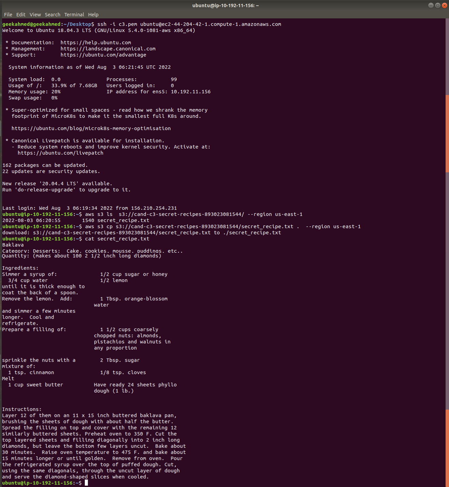

# Cloud Security - Secure the Recipe Vault Web Application
 
Project goals:
 
* Deploy and assess a simple web application environment’s security posture
* Test the security of the environment by simulating attack scenarios and exploiting cloud configuration vulnerabilities
* Implement monitoring to identify insecure configurations and malicious activity 
* Apply methods learned in the course to harden and secure the environment
* Design a DevSecOps pipeline
 
Instructions for this project are available in [this GitHub repo](https://github.com/udacity/nd063-c3-design-for-security-project-starter)

## Exercise 1 - Review Architecture Diagram
 

### Poor practices:
- The web server is deployed in a public subnet. This practice makes it a surface for the attackers to get into the instance. A more secure solution is to deploy it in the private subnet and only allow access to the LoadBalancer Security Group (AppLoadBalanceSG).
- The S3 buckets are not ecnrypted using a service like KMS for example. A solution is to use the default ecnryption of the S3 service or use a Customer Managed Keys using KMS.
- The web server security group is allowing all the traffic ingress and egress. It uses a CIDR 0.0.0.0/0 for allowing the ingress traffic on ports 22, 5000, 80, and -1 (to specify all protocols). A solution for this is to allow only the AppLoadBalanceSG to access the port 5000.
- The InstanceRole has access to all S3 buckets. This practice violates the least previlige best practice. Roles should be specific to the list of resources and actions performed upon them.
## Exercise 2 - Identify Vulnerabilities By Reviewing Security Monitoring Tools

#### AWS Config: Non Compliant Rules

- Logging is enabled for S3 buckets
- S3 buckets have policies that require requests to use Secure Socket Layer (SSL). 
- S3 bucket either has Amazon S3 default encryption enabled
- Amazon GuardDuty is enabled in your AWS account and region. 
- EC2 instances are managed by AWS Systems Manager. 
- EBS volumes that are in an attached state are encrypted.
- Checks whether HTTP to HTTPS redirection is configured on all HTTP listeners of Application Load Balancers.

#### Amazon Inspector: Findings 

- Web Service EC2 Instance is configured to allow users to log in with root credentials over SSH, without having to use a command authenticated by a public key. This increases the likelihood of a successful brute-force attack.
	- Recommendation: disable SSH root account logins
- Web Service EC2 Instance is configured to support password authentication over SSH. Password authentication is susceptible to brute-force attacks and should be disabled in favor of key-based authentication where possible.
	- Recommendation: Disable password authentication over SSH on your EC2 instances and enable support for key-based authentication instead.
- On Web Service EC2 Instance, process 'systemd-netwo' is listening on UDP port 68 which is associated with 'DHCP' and is reachable from the internet
- On Web Service EC2 Instance, process 'sshd' is listening on TCP port 22 which is associated with 'SSH' and is reachable from the internet
	- Recommendation: edit the Security Group to remove access from the internet on port 22 + 68

#### Security Hub: Findings

- S3 Secret + Free Recipe + VPC flow log buckets should have server-side encryption enabled: 
- security groups WebAppSG allow ingress from 0.0.0.0/0 to port 3389 & 22
- Attached EBS volumes should be encrypted at-rest for the Web Service Instance
 
## Exercise 3 - Attack Simulation

Run scripts that will simulate the following attack conditions: Making an SSH connection to the application server using brute force password cracking. 
Capturing secret recipe files from the s3 bucket using stolen API keys.

1. What findings were detected related to the brute force attack?
- UnauthorizedAccess:EC2/SSHBruteForce
i-06591951c5bbed25f is performing SSH brute force attacks against 10.192.10.40. Brute force attacks are used to gain unauthorized access to your instance by guessing the SSH password.

2. Research the AWS Guard Duty documentation page and explain how GuardDuty may have detected this attack - i.e. what was its source of information?
- This finding is generated only through monitoring traffic on port 22. If your SSH services are configured to use other ports, this finding is not generated. From documentation: "Amazon GuardDuty is a continuous security monitoring service that analyzes and processes the following data sources: VPC Flow Logs, AWS CloudTrail event logs, and DNS logs". VPC Flow Logs would show the attack attempts.

## Exercise 4 - Implement Security Hardening

### Remediation plan

1. Identify 2-3 changes that can be made to our environment to prevent an ssh brute force attack from the internet.
- Deploy the web server to the private subnet.
- Remove the SSH ingress rule to the WebAppSG, that is not allowing public internet ssh access.
- Remove password login for the SSH.

2. Neither instance should have had access to the secret recipes bucket, in the even that instance API credentials were compromised how could we have prevented access to sensitive data.
- Update S3 policy access to allow read from specific instances.
- Change InstanceRole to only allow read operations to the free recipe bucket.

Update the IAM policy for the instance profile role used by the web application instance to only allow read access to the free recipes S3 bucket.

Failed copy attempt following the updated IAM policy:

Set up default encryption to S3 secret recipe bucket:

Security Hub after reevaluating the number of findings:

### Questions and Analysis

1. What additional architectural change can be made to reduce the internet-facing attack surface of the web application instance.
- Transfer the web application server to the private subnet.
- Add a NAT Gateway or a Web proxy to control the egress traffic.
- Add AWS WAF in order to block the attacks to the CloudFront.
- Disallow the ssh access to the instance and use System Manager instead.
2. Assuming the IAM permissions for the S3 bucket are still insecure, would creating VPC private endpoints for S3 prevent the unauthorized access to the secrets bucket.
- This act will only prevent the internet traffic to the S3 not securing the S3 bucket.
3. Will applying default encryption setting to the s3 buckets encrypt the data that already exists?
- No. Existing objects will not be affected with the new encryption setting only the new objects get affected.
4. The changes you made above were done through the console or CLI; describe the outcome if the original cloud formation templates are applied to this environment?
- All made changes will be overriden by the cloudformation file.

## Exercise 5 - Designing a DevSecOps Pipeline

### Design a DevSecOps pipeline

### Tools and Documentation

#### Scan infrastructure as code templates
Tools:
- Regula
- Checkov

Example vulnerability
-  IAM Policies with Full Access "*".
- Encryption of S3 is not enabled.

#### Scan AMI’s or containers for OS vulnerabilities
Tools:
- Clair
- Docker Bench

Example vulnerability
- Using non-descent image or image with vulnerabilities.
- Using secret keys in plain text.
- Misconfiguration of Docker Volumes.

#### Scan an AWS environment for cloud configuration vulnerabilities
Tools:
- AWS Config
- Intruder
- Astra Pentest
- Cloud Custodian
- Prowler
- Cloudmapper

Example vulnerability
- Un-Encrypted S3 Buckets.
- Changes in IAM Policies and Roles.
- Loosely permissve Roles.
