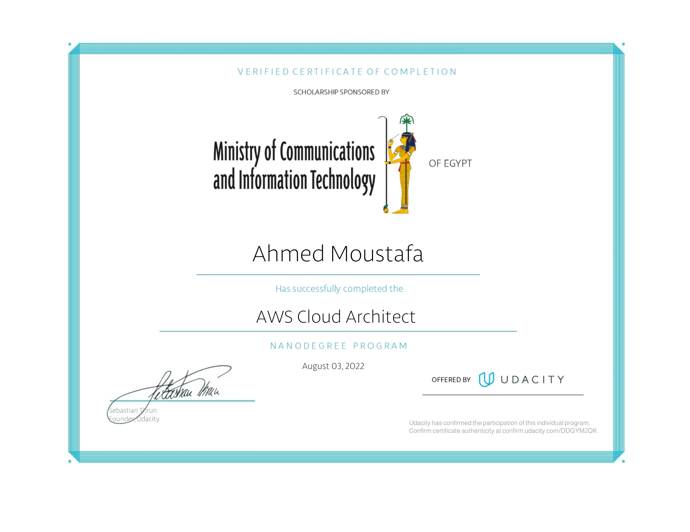

# Udacity AWS Cloud Architect
## [AWS Cloud Architect Nanodegree program](https://www.udacity.com/course/aws-cloud-architect-nanodegree--nd063)

Play a critical role in an organization’s cloud computing strategy as an AWS Cloud Architect. Learn to plan, design, and implement secure cloud infrastructure in AWS at scale. Begin by designing and building high availability infrastructure, and then move on to building scalable, secure, and cost-optimized architecture. Finally, explore and execute best practices and strategies around securing access to cloud services and infrastructure.

### Projects

- [Data durability and recovery](https://github.com/geekahmed/AWS-Cloud-Architect/tree/main/01.Design%20for%20Availability%2C%20Reliability%2C%20and%20Resiliency)
- [Design, Provision and Monitor AWS Infrastructure at Scale](https://github.com/geekahmed/AWS-Cloud-Architect/tree/main/02.Design%20for%20Performance%20and%20Scalability)
- [Cloud Security - Protecting Resources and Data in the Cloud](#)

### Certificate
You can find the certificate here: https://confirm.udacity.com/DDGYM2QK

### Contact Me For Help:
- Email: geekahmed1@gmail.com
- LinkedIn: https://www.linkedin.com/in/geekahmed